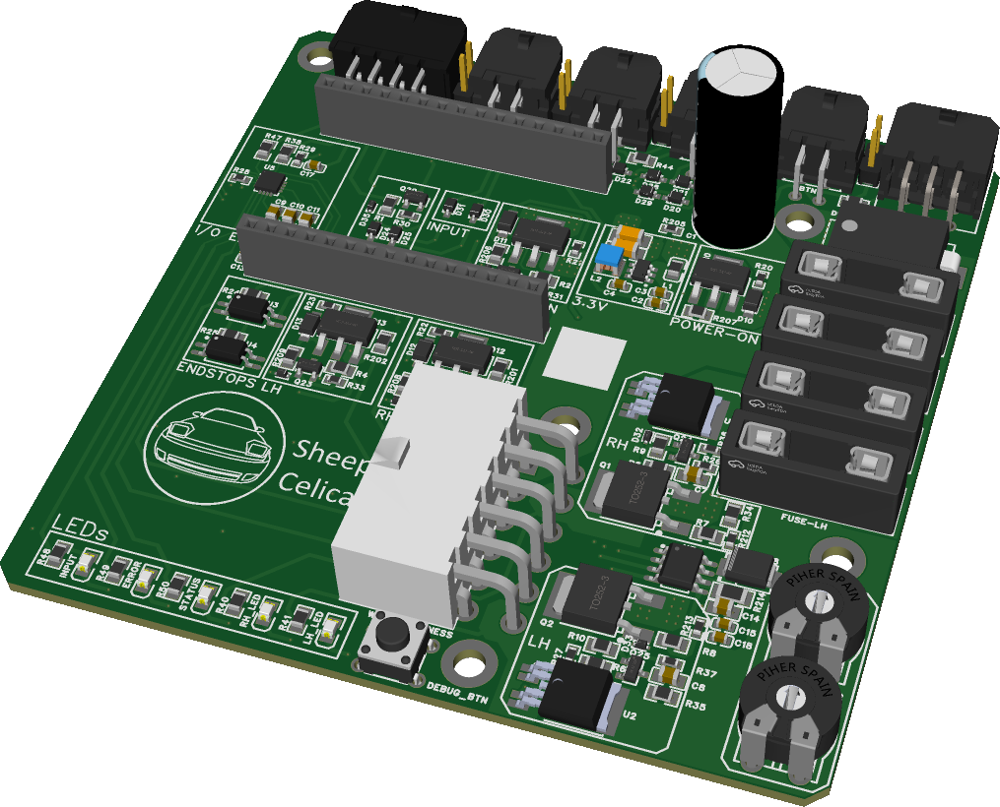

# Pop-up Controller V10

Firmware and reference source for the Pop-up Controller V10 board.

This controller is designed for 5th generation Toyota Celica T18 models as a direct replacement for the factory Light Retractor Relay. The hardware and firmware should also be usable on other pop-up headlight cars with a custom wiring adapter, but no other cars are officially supported yet.



## What This Project Is

This repository exists mainly so owners can see how the controller works, inspect the firmware, and make small changes if they want to.

The firmware runs on an ESP32-based controller board and adds features beyond the factory relay, including:

- pop-up headlight control from the factory light switch inputs
- wink control for right, left, or both pop-ups
- sleepy-eye mode with adjustable position
- optional external remote inputs
- stored calibration, persistent settings and statistics in NVS
- serial commands for communication with the [Pop-up Controller V10 Application](https://github.com/sheep-celica/Pop-up-controller-V10-Application)

## Compatibility

- Primary target: Toyota Celica T18 / 5th generation Celica
- Intended use: direct replacement for the factory Light Retractor Relay
- Possible future compatibility: other pop-up headlight cars with a custom adapter harness

## Current Status

- Board schematics are not published yet.
- The source code is available for inspection and minor customization.
- More detailed documentation now lives in [docs/](docs/README.md) and will continue to grow over time.

Useful documentation pages:

- [Documentation Index](docs/README.md)
- [Installation](docs/installation.md)
- [Application](docs/application.md)
- [Hardware Overview](docs/hardware/overview.md)
- [Build and Flash](docs/firmware/build-and-flash.md)
- [Serial Commands](docs/firmware/serial-commands.md)

## Hardware Overview

At a high level, the Revision E controller is built around an ESP32-family module and supporting parts that handle motor control, sensing, I/O expansion, power protection, and diagnostics.

Some notable hardware in the current design:

- ESP32-family module as the main controller, with ESP32 and ESP32-S3 Revision E variants
- ADS7138 internal I/O expander and ADC for on-board analog and digital signals
- PCF8574 external expander support for optional remote inputs
- two TMP112 temperature sensors for ambient and hotspot monitoring
- dual DRV8243H-Q1 motor drivers with IPROPI current sensing and integrated motor fault reporting
- TCA6408A fault and diagnostic I/O expander for motor, sensing, illumination, and local-input fault signals
- LMR51610XQDBVRQ1 step down buck for 3.3V supply
- TPS1H200AQDGNRQ1 smart switches for illumination and position sensing power
- LM2903BQDRQ1 comparator for position sensing of both pop-ups
- 
- SM8S20CA as the main TVS protection diode
- PANASONIC EEUFR1V471B as the bulk caps

## Main Behavior

The firmware monitors the headlight switch inputs and moves both pop-ups up or down accordingly. It also supports dedicated buttons and optional remote inputs for wink and sleepy-eye functions.

Some notable behavior:

- when supply voltage is below 7 V, the controller enters bench mode and disables pop-up movement
- settings such as sleepy-eye safety behavior, remote-input behavior, idle power-off timeout, and calibration values are stored persistently
- sleepy eye mode and remote inputs are disabled by default when the light-switch isn't OFF. This can be enabled at your own risk using the app
- serial commands are only processed while the pop-ups are idle

## Build From Source

This is a PlatformIO project with one environment per supported board target.

Current board environments:

- `pop-up-controller-v10-rev-c`
- `pop-up-controller-v10-rev-e`
- `pop-up-controller-v10-rev-e-esp32-s3`

Dependencies are managed through [platformio.ini](platformio.ini) and currently include:

- LM75 temperature sensor library
- PCF8574 library

Typical workflow:

```bash
pio run
pio run -e pop-up-controller-v10-rev-c
pio run -e pop-up-controller-v10-rev-e
pio run -e pop-up-controller-v10-rev-e-esp32-s3
pio run -e pop-up-controller-v10-rev-e-esp32-s3 -t upload
pio device monitor -b 115200
```

## Flashing A Prebuilt Firmware Bundle

If you do not want to build from source, download a prepared firmware bundle from the project's [GitHub Releases](https://github.com/sheep-celica/pop-up-controller-v10/releases).

These release bundles are intended to be flashed using the [Pop-up Controller V10 Application](https://github.com/sheep-celica/Pop-up-controller-V10-Application).

The export script packages the files needed for ESP32-family flashing:

- `bootloader.bin`
- `partitions.bin`
- `boot_app0.bin`
- `firmware.bin`

The repository also includes `scripts/export_flash_bundle.py` for generating a flashable bundle and an `esptool` command file.
When a GitHub release is published with a tag such as `v1.0.0`, the release workflow builds one multi-board flash bundle and attaches the zip automatically. The bundle manifest lets the application select the correct firmware by board ID.

## Serial Communication

The firmware exposes a serial command interface at `115200` baud, but in normal use that interface is mainly there so the [Pop-up Controller V10 Application](https://github.com/sheep-celica/Pop-up-controller-V10-Application) can communicate with the controller.

Manual serial commands do exist for diagnostics and configuration, but they are not intended to be used outside of the app.

One important note is that serial commands are only processed while the pop-ups are idle.

## Notes For People Browsing The Code

If you only want a quick overview:

- [src/main.cpp](src/main.cpp) contains startup flow and the main loop
- [include/config.h](include/config.h) contains project-wide configuration and pin assignments
- [src/services/pop_up_control](src/services/pop_up_control) contains the higher-level pop-up control logic
- [src/services/commands](src/services/commands) contains the serial command system
- [scripts](scripts) contains helper scripts for release metadata and firmware export
