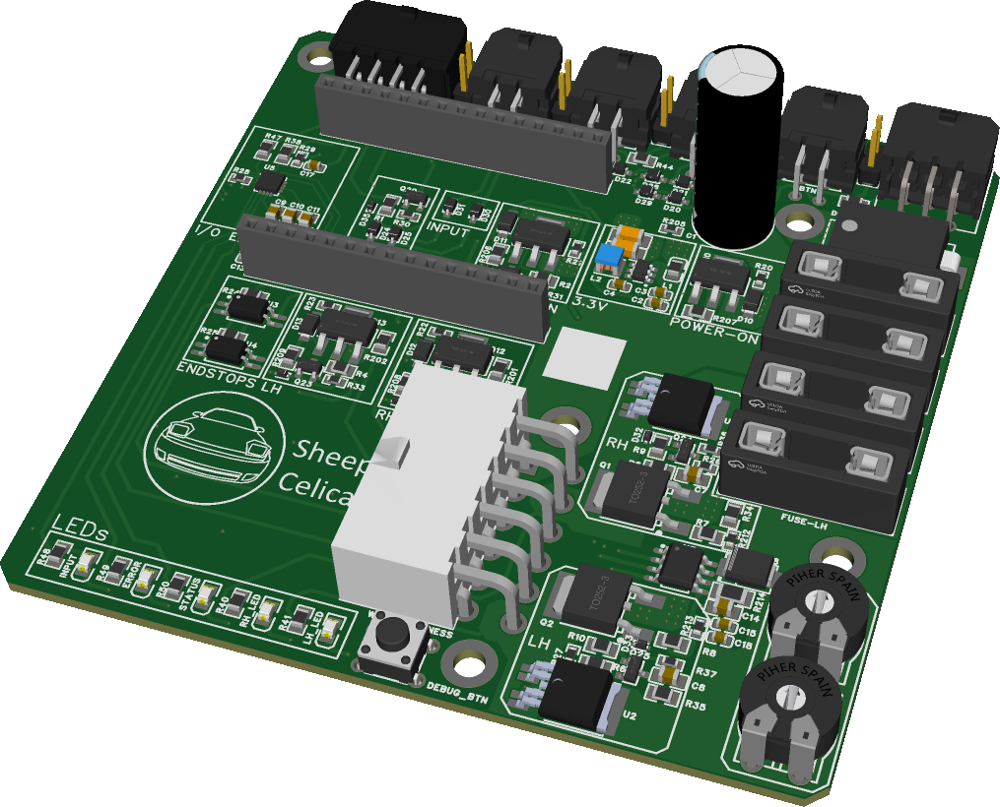

# Hardware Overview

The Pop-up Controller V10 board is designed primarily as a direct replacement for the factory Light Retractor Relay used in Toyota Celica T18 models.

## High-Level Functional Blocks

- ESP32 DevKit V1 for the main control firmware
- internal analog and digital I/O handled through the ADS7138
- optional remote input support through a PCF8574-based external expander
- temperature monitoring via an LM75-compatible sensor
- dedicated motor-control and protection hardware for the pop-up motors
- illumination, button, switch, and vehicle-facing input handling

## Current Documentation Scope

- this repo documents the firmware-facing view of the hardware
- schematics are not published here at this time
- connector-level installation details are intentionally kept out of the source repo for now

## Related Pages

- [Major Components](major-components.md)
- [I/O and Connectors](io-and-connectors.md)
